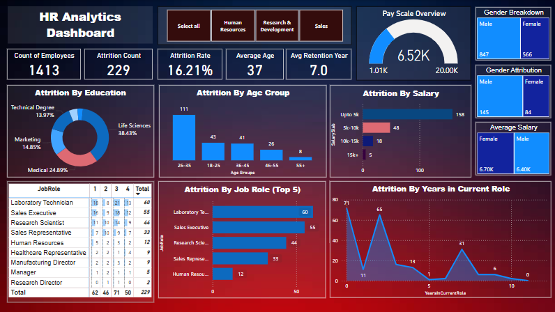
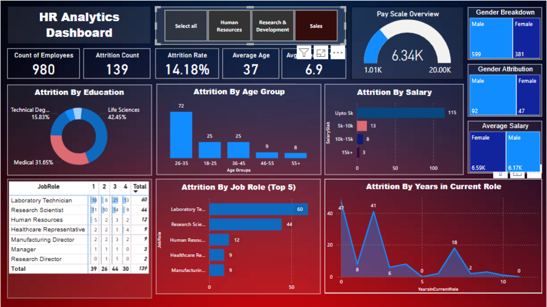

# 🚀 HR Analytics Power BI Dashboard
This project is a comprehensive **HR Analytics Dashboard built in Power BI**, designed to uncover employee attrition trends and provide actionable insights for HR and executive teams.

## 📌 Project Overview

The goal of this project is to analyze HR data and identify key drivers of employee attrition using powerful visuals and dynamic KPIs. This dashboard enables organizations to make data-informed decisions regarding workforce management, retention strategies, and compensation planning.

---

## 📊 Features

- **Interactive KPIs**: Attrition Rate, Average Salary, Employee Count
- **Drillable Visuals**: Attrition by Age, Department, Gender, Education, Tenure, Salary Band, and Job Role
- **Dynamic Slicers** for real-time data exploration
- **Custom Measures using DAX**
- **Data Cleaning & Transformation** using Power Query
- **Export & Sharing Capabilities** (PDF, .pbix, SharePoint embedding)

---

## 🔍 Key Insights

1. **High Attrition Rate**: 16.21% attrition observed
2. **Top At-Risk Groups**: Employees aged 26–35, earning ≤ $5k, from Life Sciences and Medical backgrounds
3. **Job Role Hotspots**: Laboratory Technicians and Sales Executives
4. **Gender Disparities** in attrition and average salaries
5. **Tenure Variability**: Attrition fluctuates across different years-in-role
6. **Education-Linked Attrition**: Life Sciences and Medical dominate attrition count
7. **First-year attrition**: 30% (71 out of 234), with 48 males and 23 females leaving.
---

## ✅ Recommendations

- Conduct **targeted exit interviews** for high-risk groups
- Enhance **onboarding and career development** for early-career employees
- Review and benchmark **compensation and benefits**
- Develop **role-specific retention strategies**
- Investigate **gender-specific attrition drivers**
- Improve **onboarding and early engagement**, focusing on support for new hires to reduce first-year turnover.

---

## 🧠 Methodology

1. Gathered, cleaned and formatted data using **Power Query**
2. Created relationships and calculated fields using **DAX**
3. Built visuals using **Power BI Desktop**
4. Designed an executive-level dashboard for business use
5. Exported final report for sharing with stakeholders

---

## ⚙️ Tools Used

- **Power BI Desktop**
- **Power Query Editor**
- **DAX (Data Analysis Expressions)**
- **Microsoft Excel** (for data understanding)

---

## 🔁 Scalability

This dashboard can be adapted for:
- Different departments or industries
- Predictive attrition modeling (future enhancement)

---

## 📸 Preview

---

## Tools & Skills:
Power BI | DAX | Power Query | Data Visualization | HR Analytics | Data Cleaning | Dashboard Design | Storytelling with Data

## 🤝 License

This project is open for educational and personal portfolio use.
---

## 📬 Contact

Created by **Saud Ijaz**  
📧 Email: saud20607@gmail.com || saudajaz143@gmail.com 
